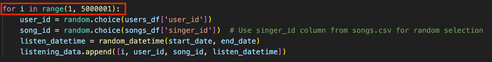
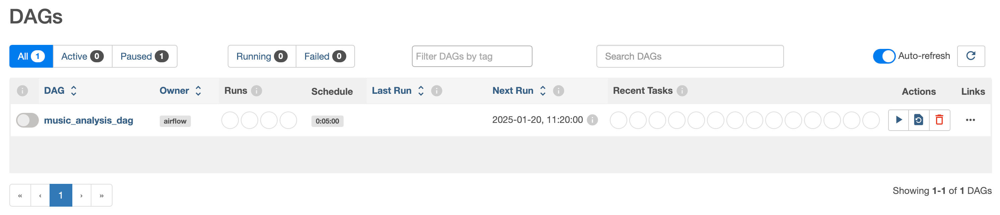
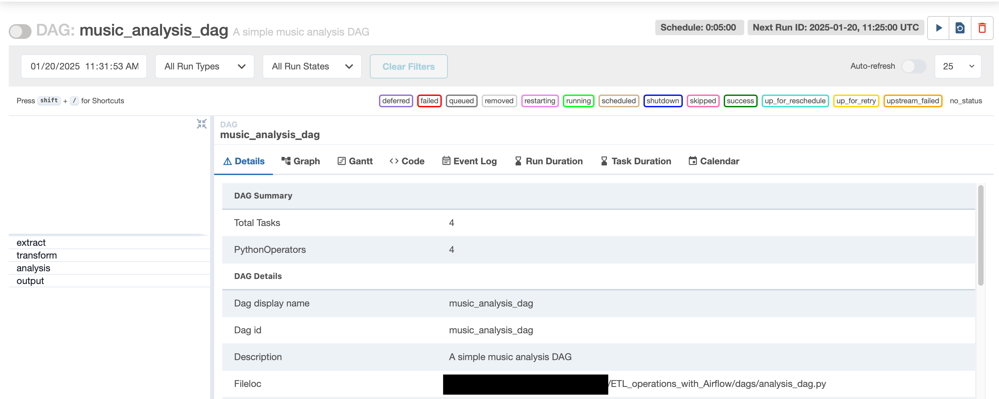
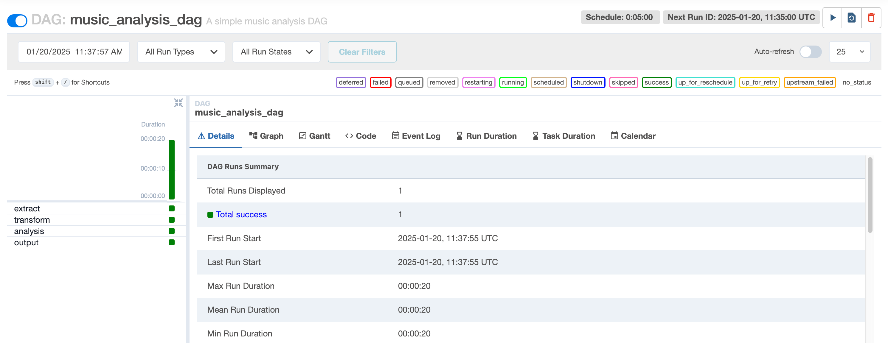

# Listening Summary
 ETL operations with Apache Airflow and analysis listening data
Project Instructions
====================
Project Purpose
---------------
* Setting up a Python environment for a project
* Installing Apache Airflow and configuring it
* Creating a DAG, scheduling it, and performing some tasks
* Reviewing the logs of the created DAG

The analyses performed here are
---------------
* Most listened singer by year
* Most listened song by year
* Most active user by year
* Most listened by city and year
* Most listened singer overall
* Most listened song overall
* Most active user overall
* Most popular hours
* Popularity change of singers
* Popularity change of songs
* User segmentation by age
* User segmentation by city
---------------------------------------------------------------------------------------------------------------------------------------------------------------------------------------------------------------------------------------------------------------------------------------------------------------------------------------------------------------------------------------
Steps
-----
### Cloning the Project
```
git clone https://github.com/Berk-Hatipoglu/Listening-Summary.git
```
### Setting Up Python Environment and Files
1. Check the Python version:
```
python3 --version
```
2. Create a Python environment:
```
python3 -m venv py_env
```
3. Activate the environment:
```
source py_env/bin/activate
```
4. In the next steps, the listening.csv file will be created. The file that will create this is the create\_listeningCSV.py file. This file creates 5 million records. We can create more or less records by updating the 5000001 value here.

5. Install the necessary libraries:
```
pip install pandas
```
```
pip install pyarrow
```
6. Run the Python script: (run commands one by one)
```
cd data
python create_listeningCSV.py
cd ..
```
### Installing and Configuring Apache Airflow
1. Follow the installation instructions from [Apache Airflow](https://github.com/apache/airflow) and use the appropriate commands for your Python version:
```
pip install 'apache-airflow==2.10.4' \
--constraint "https://raw.githubusercontent.com/apache/airflow/constraints-2.10.4/constraints-3.9.txt"
```
2. Define the project directory and execute the following commands:
```
pwd
export AIRFLOW_HOME=`pwd`
echo $AIRFLOW_HOME
```
### Starting Apache Airflow
1. Initialize the database:
```
airflow db init
```
2. Create a user:
```
airflow users create --username admin --firstname firstname --lastname lastname --role Admin --email admin@domain.com
```
3. Start the web interface:
```
airflow webserver -p 8080
```
4. Start the scheduler: (After opening a new terminal, connecting to the python environment and defining AIRFLOW\_HOME)
```
airflow scheduler
```
### Running the DAG
1. Access the web interface at [localhost:8080](http://localhost:8080) and activate the DAG. Follow the steps to monitor the execution and logs.

2. Activate DAG and refresh the page, it will automatically run for the first time. It will run again every 5 minutes.

3. The steps taken and their success statuses are displayed on the left. If you receive an error at any step, you can click on the step that received the error (the red box next to it) and examine the error from the Logs tab.

4. Finally, when we check, the results of the analysis are saved in the /output directory with a .txt extension.
Notes
---------------
* If you don’t want to see the example DAGs, set the `load_examples` parameter in the `airflow.cfg` file to `False`. Then, the scheduler and web server services are closed and started again.
* If your created DAG does not appear, check the `dags_folder` parameter. If the `load_examples` parameter is `TRUE` and you cannot see other DAGs, you can load the DAGs with the `airflow dags reserialize` command. Then, the scheduler and webserver services are closed and restarted.
* If the DAG you created is not visible, the directory pointed to by the `dags_folder` parameter in the `airflow.cfg` file is updated to be the path of the dags folder you created.I recommend that the load\_examples parameter be FALSE to make it easier to find the DAG you created.
* The `AIRFLOW_HOME` parameter must be edited again for each terminal you open.
* To exit the virtual environment, use the `deactivate` command. If you want to delete this environment, you can use the `rm -rf py_env` command.